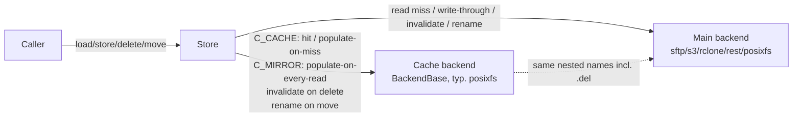

# Requirements

### Overview & Goals
Implement an **optional cache** for `borgstore` so that operations against remote backends (`sftp`, `rclone`, `s3`, `rest`) can be served from a fast local backend (typically `posixfs`) when the data is safe to cache. This addresses issue #166.

The cache is implemented at the **Store** level (not inside the `REST` backend), so it benefits every remote backend uniformly and reuses the existing `BackendBase` interface for cache storage.

### Scope

**In Scope (v1):**
- Optional cache, enabled via new arguments to `Store.__init__`.
- Cache is restricted to namespaces declared as content-hash addressed (i.e. `name == hash(content)`).
- Per-namespace mode declared via a three-valued enum `CacheMode` with members `C_OFF`, `C_CACHE`, `C_MIRROR`:
    - `C_OFF` — bypass the cache entirely (default for unlisted namespaces).
    - `C_CACHE` — full read-through + write-through. Reads check the cache first; on miss, fetch from primary and populate the cache. Writes go to primary and then to cache.
    - `C_MIRROR` — **always** read from the primary backend, but mirror the bytes into the cache on every read (in addition to write-through on `store`). Reads never short-circuit on a cache hit; the cache is purely a side-effect copy that tracks the primary.
- The cache uses the **same nested name as the primary backend**, including the `DEL_SUFFIX` (`.del`) for soft-deleted items. There is **no separate "live" cache key**: soft-delete/undelete `move` calls also rename the cache entry, just like the primary backend.
- The `cache` dict accepts either `CacheMode` members or their string aliases (`"off"`, `"cache"`, `"mirror"`, case-insensitive). String values are remapped to the enum at construction time.
- Cache backend may be specified by URL (`cache_url=`) or as a pre-built `BackendBase` instance (`cache_backend=`).
- Stats: extend `Store.stats()` with cache counters.
- Cache lifecycle (`open`/`close`/`create`/`destroy`) is tied to the Store's lifecycle.

**Out of Scope (v1):** caching of non-hash namespaces, list/info/hash/find caching, LRU eviction, background revalidation, per-call no-cache override, REST-backend-specific HTTP cache.

### User Stories
- *As a borg user* with a slow remote backend, I want repeated reads of the same hashed object to come from a local cache.
- *As an integrator*, I want to opt into caching per-namespace via `CacheMode`, passing either enum members or simple string aliases.
- *As an operator*, I want `Store.stats()` to expose cache hits/misses.

### Functional Requirements
- Caching is **off by default**; backwards compatible.
- New `cache: dict[str, CacheMode | str]` argument; missing namespaces default to `C_OFF`.
- String values in the `cache` dict are normalized at `Store.__init__` time: `"off" → C_OFF`, `"cache" → C_CACHE`, `"mirror" → C_MIRROR` (case-insensitive). Unknown strings raise `ValueError`.
- New public `CacheMode` enum is exposed at module level (importable from `borgstore.store`).
- Any namespace with mode ≠ `C_OFF` must exist in `levels` (validated at construction).
- `load`:
    - `C_CACHE` — read cache first using the same nested name the primary backend would see (including `DEL_SUFFIX` for soft-deleted items). On miss, fetch from primary, populate cache, return slice.
    - `C_MIRROR` — always fetch from primary; after a successful fetch, mirror the bytes into the cache (under the same nested name as primary, including `DEL_SUFFIX`).
    - `C_OFF` — no cache interaction.
- `store`: for `C_CACHE` and `C_MIRROR`, populate cache after primary write succeeds (cache key = primary nested name).
- `delete`: for `C_CACHE` and `C_MIRROR`, invalidate the cache entry under the exact same nested name that was deleted in the primary (so `delete(..., deleted=True)` invalidates the `.del` cache entry).
- `move`: for `C_CACHE` and `C_MIRROR`, mirror the move on the cache backend. Soft-delete (`move(delete=True)`) and soft-undelete (`move(undelete=True)`) therefore also touch the cache, renaming `foo`↔`foo.del` to keep cache and primary in lockstep.
- `find`, `info`, `hash`, `list`: unchanged.
- Stale-cache policy: passive (no proactive validation).

### Non-Functional Requirements
- No regression for callers that do not enable the cache.
- Atomicity via backends' atomic `store`.
- Concurrency-safe at the cache-directory level (relies on backend atomicity).
- Cache failures never break the main operation (caught, logged at WARNING).

# Technical Design

### Current Implementation
- `Store` (`src/borgstore/store.py`) wraps a single `BackendBase` and adds nesting, soft-delete, stats, and latency/bandwidth emulation. Constructor accepts `url`/`backend`, `levels`, `permissions`.
- `BackendBase` (`src/borgstore/backends/_base.py`) defines the minimal contract: `create/destroy/open/close/mkdir/rmdir/info/load/store/delete/move/list/hash/defrag/quota`.
- `get_backend(url, ...)` returns a backend instance for any supported URL scheme; reused for the cache backend.
- `Store.find(name, deleted=...)` probes nesting levels (and appends `DEL_SUFFIX` when `deleted=True`) to find an item. Stats are tracked via `_stats_updater`/`_stats_update_volume`.

### Key Decisions
1. **Cache lives in `Store`, not in the REST backend.** Composes naturally because the cache is itself just another `BackendBase`. *(Confirmed)*
2. **Per-namespace mode via a `CacheMode` enum** (`C_OFF`, `C_CACHE`, `C_MIRROR`) in a new `cache` dict. *(Confirmed)*
3. **Cache backend specified by URL or instance** (`cache_url=` or `cache_backend=`), symmetric to the primary backend.
4. **`C_CACHE` = read-through + write-through; `C_MIRROR` = always read primary AND populate cache on every read; `C_OFF` = bypass.** Delete/move invalidate/rename the cache entry in lockstep.
5. **Cache fully mirrors the primary's nested names — including `DEL_SUFFIX`.** Soft-deleted items in the cache live under `<name>.del`, exactly as in the primary. `move(delete=True)`/`move(undelete=True)` therefore also rename the cache entry. *(Confirmed)*
6. **`cache` dict accepts strings.** `"off" / "cache" / "mirror"` are remapped to `CacheMode` members at construction. Keeps caller configs ergonomic. *(Confirmed)*
7. **`C_MIRROR` populates the cache from every primary read too.** Every byte that flows out of the primary also flows into the cache, but the cache is never trusted as an authoritative source for reads. *(Confirmed)*
8. **Cache failures are non-fatal**, caught and logged.
9. **No eviction in v1.**

### Proposed Changes

**`src/borgstore/store.py`**
- Add a `CacheMode` enum with members `C_OFF`, `C_CACHE`, `C_MIRROR`, and a `CacheMode.from_str(value)` classmethod for string-alias normalization.
- Extend `Store.__init__` with kwargs `cache: Optional[dict[str, CacheMode | str]]`, `cache_url: Optional[str]`, `cache_backend: Optional[BackendBase]`.
- Normalize the `cache` dict at construction via `CacheMode.from_str`; reject unknown strings with `ValueError`.
- Validate: if any non-`C_OFF` cache mode is given, require exactly one of `cache_url`/`cache_backend`; all non-`C_OFF` namespaces must be in `levels`.
- Materialize `self.cache_backend` and store `self.cache_namespaces` as `(namespace, mode)` tuples sorted longest-prefix-first.
- Helpers:
    - `_cache_mode_for(name) -> CacheMode` (returns `C_OFF` if no match).
    - `_cache_get(nested_name)`, `_cache_put(nested_name, value)`, `_cache_invalidate(nested_name)`, `_cache_move(old_nested, new_nested)` — all wrap backend calls in try/except, log WARNING, update stats. The **cache key is always the same nested name that the primary backend sees**, including any `DEL_SUFFIX`.
- Modify `load`:
    - `C_CACHE`: try cache first using `nested_name = self.find(name, deleted=deleted)`; on miss, fetch full from primary, populate cache, then slice.
    - `C_MIRROR`: fetch from primary; on success, `_cache_put(nested_name, full_value)`; return slice.
    - `C_OFF`: unchanged.
- Modify `store`: after successful primary store, `_cache_put(nested_name, value)` for `C_CACHE` and `C_MIRROR`.
- Modify `delete`: after successful primary delete, `_cache_invalidate(nested_name)` for `C_CACHE`/`C_MIRROR`.
- Modify `move`: after successful primary move, mirror it on the cache via `_cache_move(old_nested, new_nested)` — applies uniformly to soft-delete, soft-undelete, generic rename, and `change_level`.
- Lifecycle: `create/destroy/open/close/create_levels` are also applied to the cache backend.
- Extend `Store.stats()` with cache counters; update `__repr__`.

**No changes** to: `BackendBase` interface, individual backend implementations, REST backend.

### Data Models / Contracts
```python
class Store:
    def __init__(
        self,
        url: Optional[str] = None,
        backend: Optional[BackendBase] = None,
        levels: Optional[dict] = None,
        permissions: Optional[dict] = None,
        *,
        cache: Optional[dict[str, "CacheMode | str"]] = None,
        cache_url: Optional[str] = None,
        cache_backend: Optional[BackendBase] = None,
    ): ...


class CacheMode(enum.Enum):
    C_OFF = "off"        # bypass cache (default for unlisted namespaces)
    C_CACHE = "cache"    # read-through + write-through
    C_MIRROR = "mirror"  # always read from primary, but mirror every read AND every write into the cache

    @classmethod
    def from_str(cls, value):
        if isinstance(value, cls):
            return value
        if isinstance(value, str):
            try:
                return cls(value.lower())
            except ValueError:
                raise ValueError(f"unknown CacheMode: {value!r}")
        raise TypeError(f"CacheMode value must be CacheMode or str, got {type(value).__name__}")
```

New stats fields: `cache_hits`, `cache_misses`, `cache_errors`, `cache_bytes_read`, `cache_bytes_written`, `cache_hit_ratio`.

Usage example:

```python
from borgstore.store import Store, CacheMode

store = Store(
  url="sftp://user@host/repo",
  levels={"data": [2], "meta": [1], "config": [0]},
  cache={
    "data": CacheMode.C_WRITETHROUGH,  # read-through + write-through
    "meta": "mirror",  # string alias -> CacheMode.C_MIRROR
    "config": "off",  # string alias -> CacheMode.C_OFF
  },
  cache_url="file:///home/u/.cache/borgstore/<repo-id>",
)
```

### Components
- **`Store` (modified)** — owns cache lifecycle and policy.
- **Cache backend** (any `BackendBase`, unmodified, reused as-is).
- **`get_backend()`** (reused) — parses `cache_url`.
- **`utils.nesting.nest`** (reused) — same nested names.

### File Structure
Modified:
- `src/borgstore/store.py`
- `docs/index.rst` (TOC), `docs/backends.rst` (cross-ref), `docs/changes.rst` (changelog).

Added:
- `docs/store_caching.rst` — dedicated docs page.
- `tests/test_cache.py` — new test module dedicated to cache behavior.

### Architecture Diagram


### Risks
- **Cache divergence under concurrent multi-client deletes.** Stale-present is still correct content (content-addressed).
- **Unbounded cache growth.** Documented; LRU deferred.
- **Cache backend failure mid-op.** Wrapped; degrades gracefully.

# Testing

### Validation Approach
Add a new `tests/test_cache.py` module that constructs a `Store` with a `tmp_path`-backed POSIX main backend and a separate `tmp_path` POSIX cache backend. Cover all three `CacheMode` values and the string-alias config explicitly.

### Key Scenarios
- **Cache disabled (default)**: existing `tests/test_store.py` tests remain green; no cache directory is created.
- **`C_CACHE` read-through populate**: second `load` does not touch the main backend (spy).
- **`C_CACHE` write-through populate**: identical bytes in both backends under the same nested name.
- **`C_MIRROR` always reads from primary**: two consecutive `load` calls both hit the primary backend (spy), even though both also populate the cache.
- **`C_MIRROR` populates on read**: `load` of an entry present only in the primary DOES create a cache entry afterward.
- **`C_MIRROR` write-through**: after `store(name, value)`, the cache backend has identical bytes.
- **`C_OFF` bypass**: explicit `C_OFF` and unlisted namespaces never touch the cache backend.
- **Invalidate on delete**: cache entry is gone after `delete` for both `C_CACHE` and `C_MIRROR`.
- **Soft-delete renames cache entry**: after `move(name, delete=True)`, the cache entry has moved from `<nested>` to `<nested>.del`; after `move(name, undelete=True)`, it moves back.
- **`deleted=True` reads use `.del` cache key**: `load(name, deleted=True)` for a soft-deleted item hits the cache entry at `<nested>.del` (under `C_CACHE`) or mirrors the primary read into `<nested>.del` (under `C_MIRROR`).
- **Generic rename / change_level**: cache entry is renamed in lockstep with the primary.
- **Partial load from cache** (`C_CACHE`): correct slice returned.
- **String aliases**: `cache={"data": "cache", "meta": "MIRROR", "config": "off"}` behaves identically to passing `CacheMode` members; unknown strings raise `ValueError`.
- **Stats**: counters match expected values for `C_CACHE` and `C_MIRROR` workloads (notably, `C_MIRROR` always increments `cache_bytes_written` on read, never `cache_hits`).
- **Lifecycle**: `create()` builds the cache dir tree; `destroy()` removes it.

### Edge Cases
- Cache backend `load` raising `ObjectNotFound` is a normal miss — not a `cache_error`.
- Cache backend `store`/`move` raising other errors is logged + counted; main op still succeeds.
- `cache` with a non-`C_OFF` entry but no `cache_url`/`cache_backend` → `ValueError`.
- `cache` namespace with mode ≠ `C_OFF` not in `levels` → `ValueError`.
- `cache` containing only `C_OFF` is accepted with no cache backend; behaves like no cache.
- `cache` value of an unknown string (e.g. `"on"`) → `ValueError` from `CacheMode.from_str`.
- `_cache_move` failure on a soft-delete/undelete: log WARNING, count as `cache_error`, primary move still succeeds.

### Test Changes
- **Add**: `tests/test_cache.py`.
- **Update**: nothing structural in `tests/test_store.py`.
- **Skip**: no real-network tests for cache behavior.

# Delivery Steps

###   Step 1: Introduce CacheMode enum (with string aliases) and add cache configuration plumbing to Store.__init__
Store accepts `cache`, `cache_url`, and `cache_backend` kwargs and validates them; a new `CacheMode` enum with string-alias support is exported. No I/O method behavior changes yet.

- In `src/borgstore/store.py`, define a new `CacheMode` enum with members `C_OFF`, `C_CACHE`, `C_MIRROR` (values `"off"`, `"cache"`, `"mirror"`) and export it at module level.
- Add a `CacheMode.from_str(value)` classmethod that accepts either a `CacheMode` instance or a case-insensitive string alias and raises `ValueError` on unknown strings.
- Add three new keyword-only constructor parameters: `cache: Optional[dict[str, CacheMode | str]]`, `cache_url: Optional[str]`, `cache_backend: Optional[BackendBase]`.
- Normalize the `cache` dict at construction by running each value through `CacheMode.from_str`, producing an internal dict of `CacheMode` members.
- Validate that at most one of `cache_url`/`cache_backend` is given; if the normalized `cache` contains any non-`C_OFF` entry, require one of them.
- Validate that every namespace in `cache` with mode ≠ `C_OFF` is also present in `levels` (raise `ValueError` otherwise).
- Materialize `self.cache_backend` (via `get_backend(cache_url)` or the passed instance, or `None` if no caching) and store `self.cache_namespaces` as a list of `(namespace, CacheMode)` tuples sorted longest-prefix-first.
- Add a `_cache_mode_for(name) -> CacheMode` helper returning `C_OFF` if no match.
- Update `__repr__` to include cache info when configured.
- No existing methods change yet — this step is purely additive and inert.

###   Step 2: Wire cache lifecycle into Store.open/close/create/destroy/create_levels
The cache backend is opened/closed/created/destroyed together with the main backend; pre-creation of nesting levels also applies to the cache.

- In `Store.create()`, call `self.cache_backend.create()` after the main backend, if a cache backend is configured.
- In `Store.destroy()`, call `self.cache_backend.destroy()` after the main backend.
- In `Store.open()`, call `self.cache_backend.open()`; on failure, log WARNING and disable the cache for the rest of the session (`self._cache_disabled = True`).
- In `Store.close()`, call `self.cache_backend.close()` and swallow errors with a WARNING.
- In `Store.create_levels()`, also pre-create the same level directories on the cache backend for namespaces whose mode is `C_CACHE` or `C_MIRROR`.
- Ensure all of this is a no-op when no cache backend is configured — zero overhead in the default path.

###   Step 3: Implement read-through (C_CACHE) and read-mirroring (C_MIRROR) in Store.load
`Store.load` consults the cache first for `C_CACHE` namespaces and populates the cache on a miss. For `C_MIRROR` namespaces it always reads from the primary but mirrors the bytes into the cache. The cache key is the exact nested name returned by `find(name, deleted=deleted)` — including `DEL_SUFFIX` for soft-deleted items.

- Add `_cache_get(nested_name) -> Optional[bytes]` and `_cache_put(nested_name, value)` private helpers. Both must catch all backend exceptions, log WARNING, and update the stats counters.
- `_cache_get` returns `None` on miss (treating `ObjectNotFound` as a normal miss, not an error).
- Modify `Store.load(name, *, size=None, offset=0, deleted=False)`:
  - Compute `mode = self._cache_mode_for(name)` and `nested_name = self.find(name, deleted=deleted)`.
  - If `mode == C_CACHE`:
    - Try `_cache_get(nested_name)`; on hit, return `value[offset:offset+size]` (mirroring `backend.load` slicing semantics).
    - On miss, call `self.backend.load(nested_name, size=None, offset=0)`, then `_cache_put(nested_name, full_value)`, and return the sliced bytes.
  - If `mode == C_MIRROR`:
    - Always call `self.backend.load(nested_name, size=None, offset=0)`.
    - On success, `_cache_put(nested_name, full_value)` (mirror every read into the cache).
    - Return the sliced bytes.
  - If `mode == C_OFF`: behave exactly like today's `load`.
  - Keep `_stats_update_volume("load", ...)` consistent (count bytes the caller receives).

###   Step 4: Implement write-through, invalidation and move-mirroring in Store.store/delete/move for C_CACHE and C_MIRROR
Cache stays in sync with successful local mutations for both `C_CACHE` and `C_MIRROR` namespaces. The cache key is always the exact nested name used against the primary backend, so soft-deleted items live under `<nested>.del` in the cache (mirroring the primary).

- Add `_cache_invalidate(nested_name)` and `_cache_move(old_nested, new_nested)` private helpers. Both must:
  - Call the corresponding `cache_backend` method.
  - Swallow `ObjectNotFound`.
  - Log other errors at WARNING and increment `cache_errors`.
- Modify `Store.store(name, value)`: after the primary backend's `store` returns successfully, call `_cache_put(nested_name, value)` if mode ∈ {`C_CACHE`, `C_MIRROR`} (where `nested_name = self.find(name)`).
- Modify `Store.delete(name, *, deleted=False)`: after the primary backend's `delete` returns successfully, call `_cache_invalidate(nested_name)` if mode ∈ {`C_CACHE`, `C_MIRROR`}, where `nested_name = self.find(name, deleted=deleted)` (so the deleted-state of the entry matches between primary and cache).
- Modify `Store.move(...)`:
  - For **soft-delete** (`move(delete=True)`) and **soft-undelete** (`move(undelete=True)`): after the primary move succeeds, call `_cache_move(old_nested, new_nested)` so the cache renames `foo`↔`foo.del` in lockstep.
  - For **generic rename**: same — `_cache_move(old_nested, new_nested)`.
  - For **change_level**: same — `_cache_move(old_nested, new_nested)`.
- Ensure all paths skip cache work cleanly when the namespace is `C_OFF` or the cache is disabled.

###   Step 5: Expose cache stats and document the feature in docs/store_caching.rst
`Store.stats()` reports cache effectiveness, and a dedicated docs page describes how to enable and use the cache.

- Extend `Store.stats()` to surface `cache_hits`, `cache_misses`, `cache_errors`, `cache_bytes_read`, `cache_bytes_written`, and a derived `cache_hit_ratio` (guarded against zero division). Ensure default values appear (0) even when the cache is not configured.
- Add a new `docs/store_caching.rst` page that explains:
  - When to enable the cache and the three `CacheMode` values: `C_OFF` (bypass), `C_CACHE` (read-through + write-through), `C_MIRROR` (always read primary, mirror every read AND write into cache).
  - That `cache` dict values may be passed as strings (`"off"`, `"cache"`, `"mirror"`, case-insensitive) and are normalized to `CacheMode` members.
  - That v1 is restricted to content-hash addressed namespaces.
  - That soft-deleted items use the same nested name in the cache as in the primary (cache entry renamed to `<name>.del` on soft-delete and back on undelete).
  - No eviction in v1, and the stale-presence caveat under concurrent multi-client deletes.
  - The stats counters surfaced by `Store.stats()`.
- Register `store_caching` in the docs TOC (`docs/index.rst`).
- Cross-reference from `docs/backends.rst` (a one-liner).
- Mention in the changelog (`docs/changes.rst`).

###   Step 6: Add tests for cache behavior in tests/test_cache.py
A new dedicated test module verifies all functional requirements end-to-end using two posixfs backends (main + cache) under `tmp_path`, covering all three `CacheMode` values and the string-alias config.

- Create `tests/test_cache.py` with a fixture building a `Store` with a posixfs main backend and `cache_url="file://<tmp>/cache"`; parametrize over `CacheMode` values where useful.
- Test: cache disabled by default (no `cache` arg) — no cache directory or files appear.
- Test (`C_CACHE`): `store → load → load` causes exactly one main-backend `load` and one cache `load` (spy on the main backend).
- Test (`C_CACHE`): write-through — after `store(name, value)`, the cache backend has identical bytes at the same nested name.
- Test (`C_CACHE`): partial load served from cache returns the exact slice the backend would have returned.
- Test (`C_MIRROR`): two consecutive `load` calls both hit the main backend (spy), and the cache contains the bytes after either call.
- Test (`C_MIRROR`): `load` of an entry present only in the main backend DOES create a cache entry (mirror-on-read).
- Test (`C_MIRROR`): `store` populates the cache with identical bytes.
- Test (`C_OFF`): explicit `C_OFF` and unlisted namespaces never touch the cache backend on any op.
- Test: string aliases — `cache={"data": "cache", "meta": "MIRROR", "config": "off"}` is normalized to enum members and behaves identically; an unknown string raises `ValueError`.
- Test: invalidation on `delete(name)` for both `C_CACHE` and `C_MIRROR`.
- Test: soft-delete (`move(delete=True)`) renames the cache entry from `<nested>` to `<nested>.del`; soft-undelete reverses this — both verified by direct inspection of the cache backend.
- Test: generic rename and `change_level` rename the cache entry in lockstep with the primary.
- Test: `load(name, deleted=True)` for a soft-deleted item uses the `<nested>.del` cache key (verified via spy that primary's `load` is/isn't called per mode).
- Test: `stats()` shows `cache_hits`, `cache_misses`, `cache_bytes_read`, `cache_bytes_written` with expected values for both modes (`C_MIRROR` increments `cache_bytes_written` on every read, never `cache_hits`).
- Test: misconfiguration — non-`C_OFF` `cache` entry without `cache_url`/`cache_backend` raises `ValueError`; cache namespace ≠ `C_OFF` missing from `levels` raises `ValueError`.
- Test: `cache` dict containing only `C_OFF` entries (including string `"off"`) is accepted without `cache_url`/`cache_backend` and behaves identically to no cache.
- Test: cache-backend error during `_cache_put`/`_cache_move` does NOT fail the surrounding `Store.store`/`Store.move` call (monkeypatch the cache backend's method to raise).